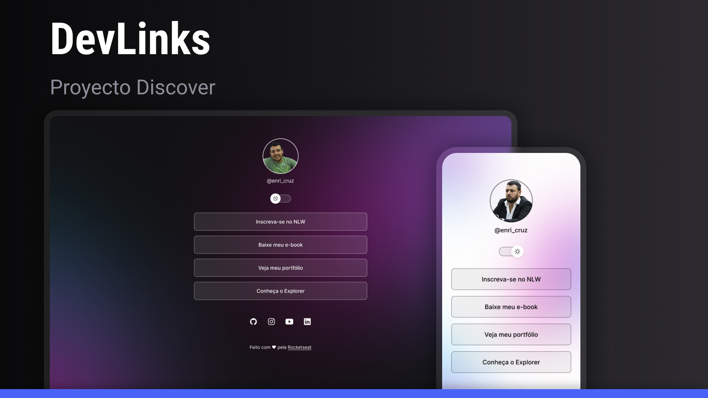

<h1 align="center"> DevLinks </h1>

 

  

## 🚀 Tecnologías

Este proyecto fue desarrollado con las siguientes tecnologías:

- HTML y CSS
- JavaScript
- Git y GitHub
- Figma

## 💻 Proyecto

DevLinks es un agregador de enlaces para usar como tarjeta de presentación en línea.

- [Accede al proyecto finalizado, en línea](https://github.com/enriPy/Proyecto_DevLinks)

## 🔖 Diseño

Puedes visualizar el diseño del proyecto a través de [ESTE ENLACE](https://www.figma.com/community/file/1187422022288947321).  
Es necesario tener una cuenta en [Figma](https://figma.com) para acceder.

Hecho con ♥ por Rocketseat 👋  
[¡Únete a nuestra comunidad!](https://discord.gg/rocketseat)
